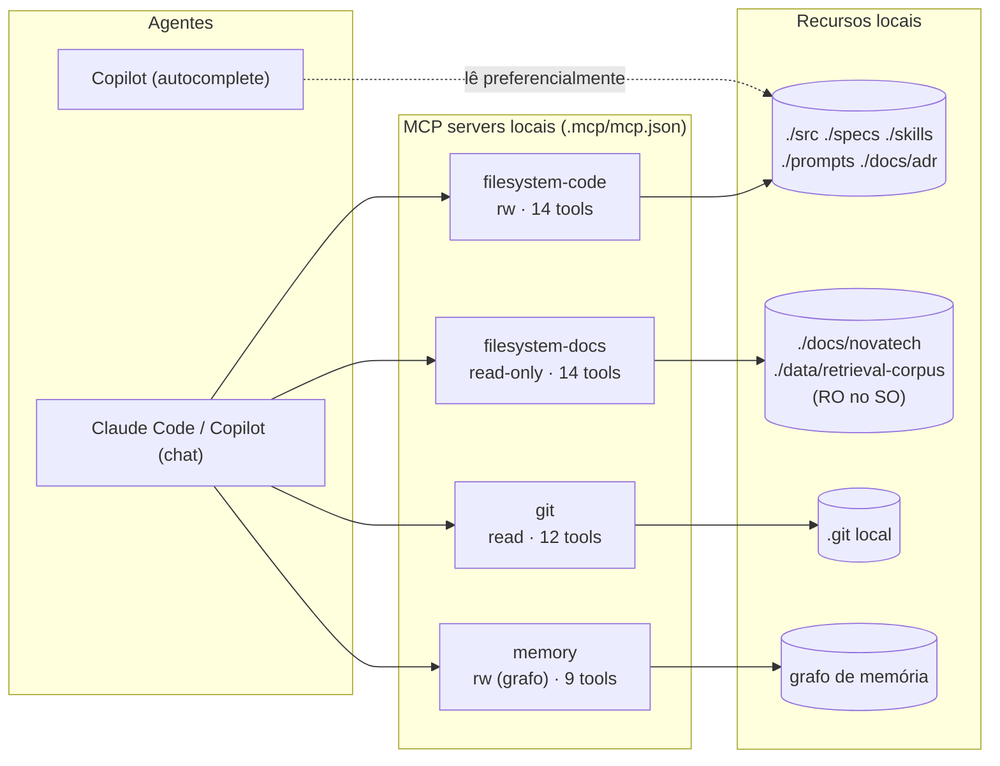

# Arquitetura de MCP — NovaTech Assistant (Tech Lead Ex. 2.2)

> MCP servers são tratados como **infraestrutura gerenciada**: versionados (no Git, em
> `.mcp/mcp.json`), com escopo/permissões mínimas, observáveis (health check) e com política
> de aprovação. Não são config ad-hoc por máquina.

## 1. Diagrama — servers, agentes e escopos

| Server | Consumido por | Escopo | Permissão | Por que é o mínimo |
|--------|---------------|--------|-----------|--------------------|
| `filesystem-code` | agentes de chat | `./src ./specs ./skills ./prompts ./docs/adr` | **rw** | exatamente o que o agente cria/edita; **não** vê `.env`, `.git`, `infra`, `node_modules` |
| `filesystem-docs` | agentes de chat | `./docs/novatech ./data/retrieval-corpus` | **read-only** (SO) | fontes de negócio nunca são escritas; instância separada para isolar permissão |
| `git` | agentes de chat | repo local | **read** (status/diff/log) | revisão de histórico; escrita de arquivos é do `filesystem-code`, não daqui |
| `memory` | agentes de chat | grafo em memória | rw, sem FS | guarda decisões/linguagem ubíqua; sem acesso a disco |

Fora do config (decisão de least privilege): `everything` (server de aprendizado das
primitivas) roda **ad-hoc**, nunca commitado — não há necessidade de produto. `github`
(arquivado no upstream, exige token externo) é substituído por `git` local.

## 2. Política de aprovação de um novo server

Adicionar/alterar server no `.mcp/mcp.json` é uma mudança de infraestrutura → passa por PR
local (`docs/pull-requests/PR-NNNN.md`) com **revisão do Tech Lead**. Checklist de aprovação:

1. **Necessidade:** qual capacidade do projeto justifica? (mapeada a um módulo/fluxo)
2. **Least privilege:** menor escopo possível. Filesystem recebe só as pastas necessárias;
   fontes de leitura entram como instância **read-only**. Sem `.env`/segredos no escopo.
3. **Local e gratuito:** reference server via `npx`/`uvx`; sem serviço pago/externo nem token.
4. **Custo de superfície:** quantas tools novas expõe? Tools de escrita exigem justificativa
   extra (podem alterar arquivos sem review).
5. **Health check:** o server passa em `scripts/mcp-health-check.mjs` antes do merge.

Equilíbrio: mudança de **escopo** dentro de um server já aprovado = revisão leve (1 aprovação
do TL). **Novo server** ou **nova permissão de escrita** = revisão completa (checklist acima).
Não burocratiza o dia a dia, mas nenhuma ampliação de acesso entra sem o gate.

## 3. Monitoramento

- **Health check sob demanda e no CI:** `node scripts/mcp-health-check.mjs` (saída real em
  [`health-check-output.md`](health-check-output.md)). Reporta, por server: subiu? handshake
  ok? quantas tools? escopo existe no disco? Exit code ≠ 0 derruba o passo de CI.
- **O que observar (sinais de falha):**
  - server não sobe (`spawn falhou` / `processo saiu`) → pacote ausente, `npx`/`uvx` offline;
  - `timeout` no handshake → server travado;
  - `[scope] ... FALTANDO` → pasta movida/renomeada; o agente perderia acesso silenciosamente
    se não fosse detectado;
  - queda na contagem de tools entre execuções → versão do server mudou o contrato.
- **Cadência:** rodar antes de uma sessão de desenvolvimento intensa e no pipeline de CI.

## 4. Versionamento (mudar escopo sem quebrar fluxos)

- `.mcp/mcp.json` é **versionado no Git** (JSON padrão, sem chaves não-padrão); toda mudança
  tem diff revisável e histórico.
- Escopo e justificativa de cada server ficam em [`.mcp/README.md`](../../.mcp/README.md),
  versionado ao lado da config — a intenção fica documentada sem poluir o JSON.
- **Mudança de escopo é aditiva por padrão.** Remover uma pasta de um server pode quebrar um
  fluxo que dependia dela; por isso remoção exige: (a) `grep` por usos, (b) nota no PR, (c)
  health check verde depois. Renomear pasta = atualizar o escopo no mesmo PR que renomeia.
- **Compatibilidade:** instâncias separadas por permissão (`filesystem-code` vs
  `filesystem-docs`) permitem evoluir uma sem afetar a outra.

## 5. Plano de contingência (server indisponível)

Princípio: **agente degradado com aviso > agente que inventa**. Nunca alucinar para cobrir a
falta de uma fonte.

| Server cai | Efeito | Comportamento esperado do agente |
|------------|--------|----------------------------------|
| `filesystem-docs` (fontes) | sem acesso à documentação NovaTech | **NÃO inventar** prazos/valores. Responder: "Não consigo acessar a base documental agora; não vou arriscar um valor. Tente novamente ou escale ao supervisor." (alinhado ao guardrail "quando em dúvida"). |
| `filesystem-code` | sem ler/editar código | parar geração que dependa do código atual; avisar que está sem contexto do repo, em vez de gerar às cegas. |
| `git` | sem histórico/diff | seguir com capacidade reduzida (sem revisão de histórico); avisar que a análise de mudanças está indisponível. |
| `memory` | sem grafo persistente | operar stateless na sessão; avisar que decisões/linguagem ubíqua não serão persistidas. |

Regras gerais de degradação:
1. **Falhar visível, não silencioso:** o health check detecta `FALTANDO`/`FAIL`; o agente
   declara a limitação na resposta.
2. **Fonte de verdade é o documento:** sem `filesystem-docs`, prazos/valores **não** vêm da
   memória nem de chute — a resposta é a recusa explícita.
3. **Reduzir capacidade, não derrubar tudo:** a queda de um server desabilita só os fluxos
   que dependem dele; os demais continuam.
